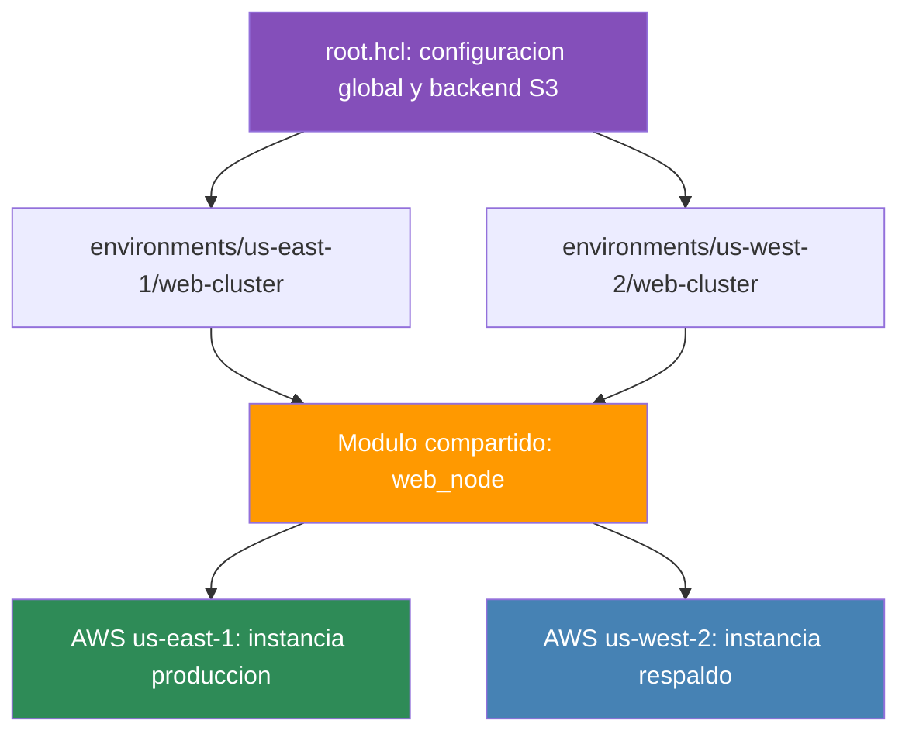

# Laboratorio de Infraestructura como Código

## Arquitectura Multirregión con Terragrunt


---

Este repositorio contiene la implementación de una arquitectura web altamente disponible, distribuida en múltiples regiones de Amazon Web Services, gestionada mediante el uso combinado de Terraform y Terragrunt.

## Propósito del laboratorio

El objetivo principal de este proyecto es centralizar, estandarizar y automatizar el despliegue de recursos de infraestructura en la nube, minimizando la duplicación de código bajo el principio DRY (Don't Repeat Yourself) y garantizando el aislamiento de los estados de configuración.

## Alcance técnico y logros

| Área | Descripción |
|---|---|
| Gestión de estado centralizada | Backend remoto único en un bucket de Amazon S3 (us-east-1) con bloqueo de estado |
| Inyección dinámica de parámetros | Terragrunt hereda configuraciones globales desde root.hcl y calcula las rutas de los estados tfstate según el entorno y la región |
| Estandarización del motor de ejecución | Fijación del binario nativo de Terraform para asegurar compatibilidad y consistencia en el ciclo de vida de los recursos |
| Despliegue multirregión aislado | Nodos de cómputo independientes para producción y respaldo, en us-east-1 y us-west-2 |
| Auditoría y validación | Verificación estructural del almacenamiento en S3 y resolución de dependencias de red regionales mediante aprovisionamiento automatizado |

## Regiones desplegadas


## Arquitectura de archivos y flujo



## Estructura del repositorio

```
.
├── root.hcl
├── environments
│   ├── us-east-1
│   │   └── web-cluster
│   │       └── terragrunt.hcl
│   └── us-west-2
│       └── web-cluster
│           └── terragrunt.hcl
├── modules
│   └── web_node
│       ├── main.tf
│       ├── variables.tf
│       └── outputs.tf
└── scripts
    └── listar_backend.sh
```

## Verificación del backend remoto

La distribución de los estados remotos en el bucket global `garagorry-sre-tfstate-global` quedó organizada bajo el siguiente esquema jerárquico de aislamiento:

```
iac-mastery_7/environments/us-east-1/web-cluster/terraform.tfstate
iac-mastery_7/environments/us-west-2/web-cluster/terraform.tfstate
```

---

Desarrollado como parte del programa de especialización en Site Reliability Engineering e Infraestructura como Código.

