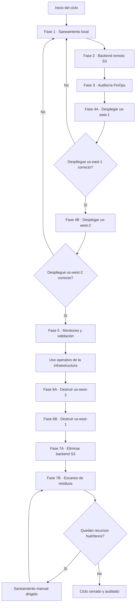
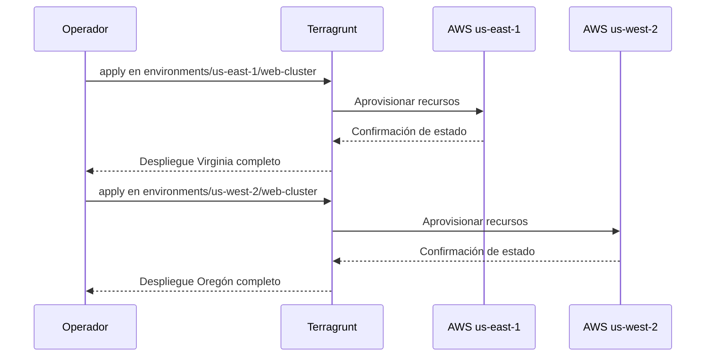
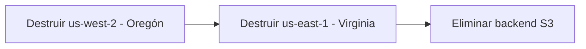
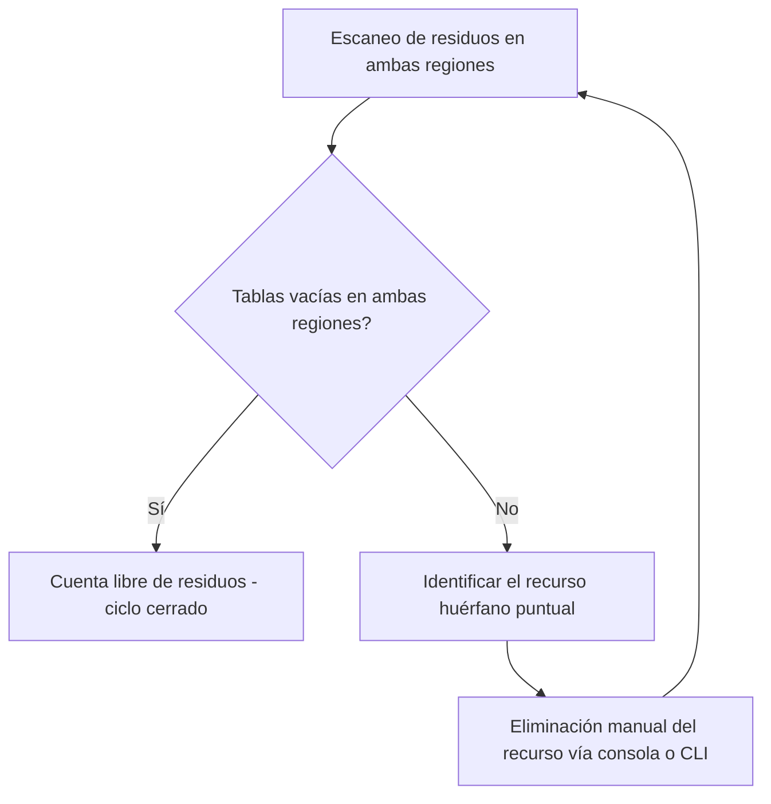

# Runbook — Operación de Infraestructura Multirregión (Lab 7)


Este documento describe, paso a paso, el ciclo de vida completo de la infraestructura en AWS gestionada con Terraform y Terragrunt: desde el saneamiento del entorno local hasta la destrucción total y la auditoría de residuos. Cada fase incluye el comando exacto, el motivo técnico detrás de él y, cuando aporta claridad, un diagrama del flujo de decisiones.

---

## Mapa general del ciclo de vida

Antes de entrar en el detalle de cada fase, este diagrama resume el recorrido completo y, sobre todo, **hacia dónde se retrocede cuando algo falla**. Esa distinción es la parte más importante del runbook: un despliegue fallido se corrige reintentando el saneamiento y el despliegue; una auditoría final con residuos **nunca** se corrige volviendo a desplegar, sino yendo a un saneamiento manual.



Nota sobre el diagrama: las ramas de error de despliegue (`F` y `H`) regresan al **saneamiento local**, porque la causa más común de un `apply` fallido es un estado local sucio o binarios inconsistentes, no la infraestructura ya aplicada. En cambio, la rama de error de la auditoría final (`O`) nunca regresa a un nodo de despliegue: si aparecen recursos huérfanos después de haber ejecutado `destroy`, el problema es que algo no se borró, y la respuesta correcta es un saneamiento manual dirigido (revisar consola de AWS, borrar el recurso puntual, repetir el escaneo), no levantar infraestructura nueva.

---

## Fase 1 — Prerrequisitos y saneamiento local

Antes de tocar la nube, se verifica que las herramientas locales y el estado del repositorio estén limpios. Esta fase evita el error más frecuente en entornos con Terragrunt: mezclar cachés de ejecuciones o motores distintos.

### 1.1 Validación de binarios

```bash
terraform --version
terragrunt --version
aws --version
```

> **Por qué se hace:** Terragrunt delega en el binario de Terraform que esté configurado, y una diferencia de versión entre lo que el equipo espera y lo que hay instalado localmente puede producir bloqueos de estado incompatibles o comportamientos de `plan` inesperados. Verificar versiones antes de cualquier acción es más barato que depurar un `apply` a medio camino.

### 1.2 Limpieza de caché local

```bash
find . -type d -name ".terragrunt-cache" -exec rm -rf {} +
find . -type d -name ".terraform" -exec rm -rf {} +
find . -type f -name ".terraform.lock.hcl" -exec rm -f {} +
```

> **Por qué se hace:** Estos directorios ocultos guardan copias locales de los proveedores y módulos descargados en la ejecución anterior. Si el motor de ejecución cambió, o si otra persona corrió el mismo módulo con una configuración distinta, esa caché queda desincronizada respecto a lo que el código fuente realmente declara hoy.
>
> **Nota importante:** este borrado no es opcional cuando se modifica la directiva `terraform_binary` dentro de `root.hcl`. Si el proyecto migró de OpenTofu a Terraform nativo (o viceversa), la caché de `.terragrunt-cache` puede seguir apuntando a binarios, providers o metadatos generados por el motor anterior. Ejecutar `apply` sin limpiar antes esa caché es la causa más común de errores de bloqueo de estado o de "provider inconsistency" justo después de un cambio de motor.

---

## Fase 2 — Inicialización del backend remoto aislado

El estado de Terraform no debe vivir en el disco local: se centraliza en un bucket S3 dedicado, que actúa como fuente única de verdad para todos los entornos.

### 2.1 Script de preconfiguración

```bash
./scripts/preconfiguracion.sh
```

> **Por qué se hace:** este script crea (o valida) el bucket S3 de estado en la región de control, junto con las políticas mínimas de acceso. Centralizar el backend antes de aplicar cualquier módulo evita que dos ejecuciones distintas escriban estado en ubicaciones diferentes, lo que rompería el bloqueo de concurrencia.

### 2.2 Auditoría inicial del backend

```bash
./scripts/listar_backend.sh
```

> **Por qué se hace:** confirma, antes de desplegar nada, que el bucket existe físicamente en `us-east-1` y que la cuenta tiene visibilidad sobre él. Detectar un backend mal configurado en este punto cuesta segundos; detectarlo a mitad de un `apply` cuesta un estado corrupto.

---

## Fase 3 — Auditoría FinOps pre-despliegue

```bash
infracost breakdown --path environments/us-east-1/web-cluster
infracost breakdown --path environments/us-west-2/web-cluster
```

> **Por qué se hace:** estimar el costo proyectado de cada entorno antes de aplicarlo permite detectar configuraciones sobredimensionadas (tipos de instancia, volúmenes, tráfico entre zonas) antes de que generen facturación real. Es control financiero preventivo, no reactivo.

---

## Fase 4 — Despliegue secuencial aislado

El aprovisionamiento se hace región por región, nunca en paralelo, para poder aislar un fallo de red o de disponibilidad de zona sin que afecte al otro entorno.



### Fase 4A — Infraestructura principal (us-east-1, Virginia)

```bash
cd environments/us-east-1/web-cluster
terragrunt apply -auto-approve
```

### Fase 4B — Infraestructura de respaldo (us-west-2, Oregón)

```bash
cd ../../us-west-2/web-cluster
terragrunt apply -auto-approve
```

> **Por qué se hace en este orden:** Virginia se trata como el entorno primario y Oregón como el de respaldo. Desplegar primero el primario permite validar que la configuración base funciona antes de replicarla en la región secundaria, reduciendo el riesgo de propagar un error de diseño a ambas regiones al mismo tiempo.

---

## Fase 5 — Monitoreo y validación de estado

Con la infraestructura aprovisionada, se valida que el estado remoto y los recursos reales sean consistentes entre sí.

### 5.1 Monitoreo del estado en el backend

```bash
cd ../../../
./scripts/listar_backend.sh
```

> **Por qué se hace:** confirma que Terragrunt efectivamente escribió los archivos de estado de ambas regiones en el bucket, y no solo que el `apply` terminó sin errores en consola.

### 5.2 Monitoreo de recursos en AWS

```bash
aws ssm get-parameter --name "/sre/infra/us-east-1-prod/status" --region us-east-1
aws ssm get-parameter --name "/sre/infra/us-west-2-backup/status" --region us-west-2
```

> **Por qué se hace:** el Parameter Store expone un valor dinámico que refleja el estado operativo real de cada nodo, independiente de lo que diga el estado de Terraform. Es la verificación cruzada entre "lo que Terraform cree que existe" y "lo que AWS reporta que existe".

---

## Fase 6 — Destrucción de la infraestructura de cómputo

La destrucción se ejecuta en **orden inverso** al despliegue: primero el entorno de respaldo, después el principal. Esto evita dejar recursos de respaldo huérfanos apuntando a un primario que ya no existe.



### Fase 6A — Desmantelamiento en Oregón (us-west-2)

```bash
cd environments/us-west-2/web-cluster
terragrunt destroy -auto-approve
```

### Fase 6B — Desmantelamiento en Virginia (us-east-1)

```bash
cd ../../us-east-1/web-cluster
terragrunt destroy -auto-approve
```

> **Por qué se hace en este orden:** si Virginia se destruyera primero, cualquier recurso de Oregón con dependencias cruzadas (referencias de red, réplicas, endpoints) podría quedar en un estado inconsistente al perder su contraparte principal antes de tiempo.

---

## Fase 7 — Eliminación del backend y auditoría de residuos

Esta es la fase de cierre: garantiza que no queden instancias encendidas, parámetros huérfanos ni costos ocultos en la cuenta.

### 7.1 Destrucción de objetos y bucket S3

```bash
cd ../../../
./scripts/eliminar_backend.sh
```

> **Por qué se hace:** una vez destruidos los entornos de cómputo, el backend de estado ya no tiene función. Mantenerlo vivo solo agrega superficie de ataque y costo de almacenamiento sin necesidad.

### 7.2 Escaneo quirúrgico de recursos huérfanos

**Verifica Las 2 Regiones East and West and Backend:**

```bash
./scripts/auditoria_forense.sh
```

> **Por qué se hace:** consultar directamente las APIs de AWS, en lugar de confiar en el `output` de `terragrunt destroy`, es la única forma de certificar que no quedó ningún recurso fuera del control de Terraform (por ejemplo, creado manualmente o desde otra ejecución).

### 7.3 Lógica de decisión ante residuos



> **Punto crítico de diseño:** si el escaneo detecta recursos huérfanos, la respuesta correcta **no** es volver a ejecutar `terragrunt apply`. Eso levantaría infraestructura nueva sobre una cuenta que ya tiene restos sin identificar, empeorando el problema. La única rama válida es identificar el recurso puntual (por su ID o nombre de parámetro) y eliminarlo manualmente, repitiendo después el escaneo hasta que ambas tablas retornen vacías.

---

## Resumen de criterios de cierre

| Verificación | Resultado esperado | Acción si falla |
|---|---|---|
| `describe-instances` en ambas regiones | Tabla vacía | Eliminación manual del recurso e ID reportado |
| `describe-parameters` en ambas regiones | Tabla vacía | Eliminación manual del parámetro reportado |
| Backend S3 | Bucket eliminado | Reejecutar `eliminar_backend.sh` |

Si ambas tablas retornan vacías en las dos regiones, la cuenta se encuentra libre de residuos y el ciclo de vida de la infraestructura ha concluido correctamente.

